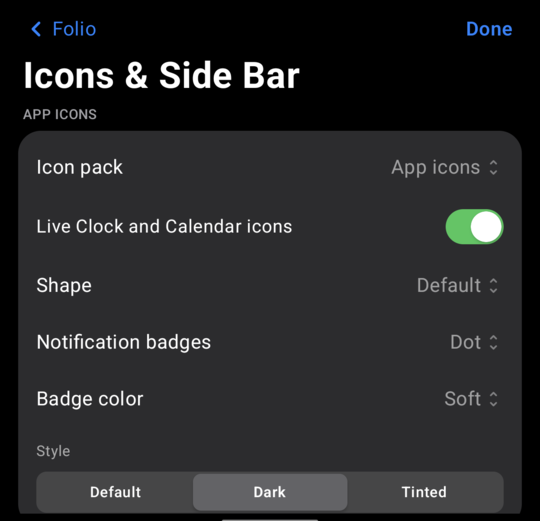

# Folio

A clean, iPhone-style Home Screen for Android, with the jailbreak tweaks I always wanted, and none of the lockdown.

<p align="center">
  
</p>

> **Status:** very early. I just wanted to get something out. It's a bit rusty in places, and things will settle down
> as more people use it: more feedback means I can work on performance and fine-tuning. I plan to keep maintaining it. Developed and tested on a Galaxy Z Fold8. See what's changed in [CHANGELOG.md](CHANGELOG.md).

## Why I made this

Honestly, I started this for fun. I've spent the last few months building an iPhone app, then I got a Galaxy Z Fold8
and got excited by how much Android lets you customize. At the same time I felt a little homesick for Apple, or at
least for the jailbreak features I loved. I've been in the iOS jailbreak world since iOS 7 or 8, so this was me getting
back into it.

The hardest part was learning Android: how permissions work and how launchers work. I got the hang of it. Right now
I'm the only one using Folio, so I use AI to help bug test it. With more people trying it, that'll change. Anything
that came from someone else, or that inspired me, is credited [below](#credits).

I want to give back to the open-source community, so Folio is free and open source.

## Who it's for

Anyone who wants a clean look, likes the Apple style without Apple's restrictions, or just wants their phone to work
the way *they* want. I'm building what I knew I couldn't have on iPhone.

I found jailbreaking in middle school and loved it. iOS keeps getting more locked down, so I moved to something more
open (for now, until Google locks theirs down too). I also have an app in testing on the App Store, and that alone was
a three-month process, so I'll do what it takes to make what I want.

**Have an idea? Tell me!** And if you want to help build Folio, or make a theme or a tweak for it, [let me know](#get-involved).

## A few of my favorite parts

Some of my favorite days on my phone were spent with tweaks like Barrel, just making the phone my own. Folio is my
way of bringing that back:

- **Badges that match the app.** Badges can take the color of each app's icon, like the ColorBadges tweak. It was more
  complex than I expected, but it's neat, so check it out (Settings › Icons & Side Bar › Badge color).
- **Themes, and more on top.** I loved SnowBoard. Android already has icon packs and themes, so Folio builds on them
  with its own themes you can save and share.
- **The iPhone Duo Side Bar.** The status bar, Dynamic Island and dock live on the right edge. Thanks to
  [DuoLauncher](https://github.com/jakesgoodapps/DuoLauncher), whose dev made it possible for me to build on top of their work.
- **Left-handed mode and Spotlight.** Flip the Side Bar to the left, and search everything from Spotlight.
- **Coming soon: Page Effects,** inspired by Barrel. See Settings › Coming Soon for what else is planned.

There's a lot to this launcher, and it's fun. I hope you have as much fun with it as I've had making it.

## What it does

**Adapts to the screen, doesn't just stretch**
- Lays out by how much room there is, not what device it is: phones, flips, foldables, split-screen, tablets.
- Open the Fold and you get two Home pages side by side. Portrait unfolded gets one centered page with a dock bar. The cover in landscape gets two columns.
- Knows where the fold is: when the phone is half folded, sheets, menus and Home rows move off the crease.
- Bigger screens draw everything bigger, like iPad, instead of a tiny phone layout in the middle.

**The iOS stuff**
- Side Bar with the status bar, a Dynamic Island that wraps the camera, and the dock.
- Notification Center, Control Center, Spotlight, Today View, Smart Stacks and the widget gallery.
- Jiggle mode, folders, Icon Stacks, per-page icon size and labels, and App Library search.
- Clear Badge from an app's long-press menu.
- Focus modes with schedules and the Home pages you want to see.
- Download rings on updating apps, blue dots on new ones, and Add to Home Screen for shortcuts and websites.
- Settings built like iOS: menus with checkmarks, segmented controls, switches, sheets and alerts. What's New shows up after updates.

**Tweaks (all off until you turn them on)**
- Ideas from jailbreak tweaks I liked (Velox, Activator, Velvet, Axon, ColorFlow, Harbor), rebuilt from scratch.
- Turn a tweak on for just the cover or just the inner screen, and Safe Mode if something crashes.

**Themes**
- Save your look as a theme file, import one, or share a `.json` theme straight to Folio from Files or Chrome.
- Grab community themes (or add yours) in [`themes/`](themes/).
- Pick an alternate app icon (Olive or Soft), and live Clock and Calendar icons that match your other icons.

**Betas (off until you turn them on)**
- Layout History: saves Home before big changes so you can go back.
- Recent App Dots: a dot beside dock apps you used in the last hour.

**Private**
- No accounts, no ads, no analytics. Folio itself doesn't send anything anywhere unless you share a crash report.
  Google search, Discover and widgets from other apps use those apps' own services. Every permission is optional and
  explained where it's used. More in [PRIVACY.md](PRIVACY.md).

## What you need

- Android 12 or newer.
- Made on a Galaxy Z Fold, but it's meant to work on any Android phone, flip, tablet or Chromebook. I haven't tried a
  real tablet yet, so let me know how it goes.

## Install

Download the APK from [Releases](https://github.com/McCal-Codes/folio/releases), open it on your phone and allow the
install. Then press Home and pick Folio, or open Folio and tap **Set as home app**.

Each release lists the APK's SHA-256 and the signing certificate, so you can check an update comes from the same key.
A release APK can't install over a build you made yourself (different signing keys); see
[troubleshooting](docs/troubleshooting.md#an-update-wont-install).

## Build it

```bash
JAVA_HOME=/opt/homebrew/opt/openjdk@17 ./gradlew :app:assembleFast
adb install -r app/build/outputs/apk/fast/app-fast.apk
```

`assembleFast` is the optimized build I use day to day. `:app:assembleDebug` works too (APK in
`app/build/outputs/apk/debug/`). After installing, press Home and pick Folio, or open Folio Settings and tap
**Set as home app**.

Tests: `./gradlew :app:testFastUnitTest`

## Where things are

- `app/src/main/java/com/mccal/folio/`: the launcher (Kotlin, Jetpack Compose, Jetpack WindowManager)
  - `LayoutModel.kt`: screen sizes, Home layout and big-screen scaling
  - `LauncherScreen.kt`, `HomeWorkspace.kt`: Home, pages and editing
  - `StatusRail.kt`, `CutoutIsland.kt`: the Side Bar status bar and Dynamic Island
  - `CustomizationSheet.kt`, `IosControls.kt`, `FolioSheet.kt`: Settings and the iOS controls
- `app/src/test/`: unit tests, including the screen size tests
- `themes/`: community themes and the theme format
- `docs/`: [user guide](docs/user-guide.md), [troubleshooting](docs/troubleshooting.md), [architecture](docs/architecture.md)

## Get involved

**Bug reports, please!** That's the help I need most right now. Once there's a community, I'll give a shoutout (or
something for whoever finds the most). Themes and code can come later. I'm one person doing this, but anyone who's
interested is welcome. Read [CONTRIBUTING.md](CONTRIBUTING.md) first. No GPL code and nothing that needs root.

- Found a bug? In Folio, go to Settings › **Report a Bug**, or use the [bug form](https://github.com/McCal-Codes/folio/issues/new/choose).
- Questions or want to show off your setup? [Discussions](https://github.com/McCal-Codes/folio/discussions).
- Security problem? Report it privately, see [SECURITY.md](SECURITY.md).
- Everyone here follows the [Code of Conduct](CODE_OF_CONDUCT.md).

If you want to support the project, I'll add a Ko-fi link in time.

## Contact

- **Email:** [contact@mcc-cal.com](mailto:contact@mcc-cal.com) (for serious things)
- **Discord:** mcc_cal
- **Reddit:** [u/wolftech029](https://www.reddit.com/user/wolftech029)
- **X (Twitter):** [@mcc_cal_](https://x.com/mcc_cal_), where I'll post new features and sneak peeks until there's a community

## Thank you

To the iOS jailbreak community, for inspiring me since I was a kid. To the few people on Reddit making things I could
build a bridge from. And to anyone else who's interested in my fun little project.

## Credits
- **[DuoLauncher](https://github.com/jakesgoodapps/DuoLauncher)** by [jakesgoodapps](https://github.com/jakesgoodapps) and the Duo Launcher contributors (MIT): Folio's starting codebase — the iPhone Duo-style right-side dock and layouts for both Fold screens, paired Home pages and the unfolded workspace, Android widgets, folders, work profiles, wallpapers with sunrise/sunset switching, and Google search/Discover.
- **[iphone-duo](https://github.com/chuspeeism/iphone-duo)** by chuspeeism (MIT): the blur/darkening curves and hinge-angle model that Folio's fold shader follows.
- **u/moomanjohnny** on r/GalaxyFold: the Galaxy Z Fold 8 proof of concept that showed screenshots + shaders + hinge sensors can recreate the iPhone Duo unfold; inspired Folio's screenshot-morph fold style. No code was released or used.
- **[QuickLaunch](https://github.com/AhmedTheGeek/QuickLaunch)** by AhmedTheGeek (GPL-3.0): ideas for Spotlight — requesting the keyboard after the first frame, frecency ranking with a 7-day half-life, and drag-to-split-screen. Re-implemented independently; no QuickLaunch code is included.
- **iOS jailbreak tweaks** (ideas only, re-created from scratch; no code): Velox by Phillip Tennen (app panels), Activator by Ryan Petrich (gesture and event actions), Axon by Nepeta (notification app row), Velvet by NoisyFlake & HiMyNameisUbik (tinted notifications), ColorFlow by David Goldman (album-art colors), Harbor by Evan Swick (dock magnification), SnowBoard by SparkDev (themes), Apex by Sticktron (Icon Stacks), Icon Restore (Layout History), Lynx 2 (recent-app dots), ColorBadges (badges that match the app) and Barrel (Page Effects, coming soon). Authors for Velox through Harbor as credited by iDownloadBlog.

Folio started from [DuoLauncher](https://github.com/jakesgoodapps/DuoLauncher)
(commit `f1bc0f1`, 10 Sep 2026), © 2026 Duo Launcher contributors, used under the MIT License (see `LICENSE`).
Third-party dependency licenses are listed in `THIRD_PARTY_NOTICES.md`.
Apple, iPhone and iPad are trademarks of Apple Inc., registered in the U.S. and other countries and regions.
Google and Android are trademarks of Google LLC. Samsung and Galaxy are trademarks of Samsung Electronics Co., Ltd.
Folio is an independent project and is not affiliated with or endorsed by Apple, Google or Samsung.
